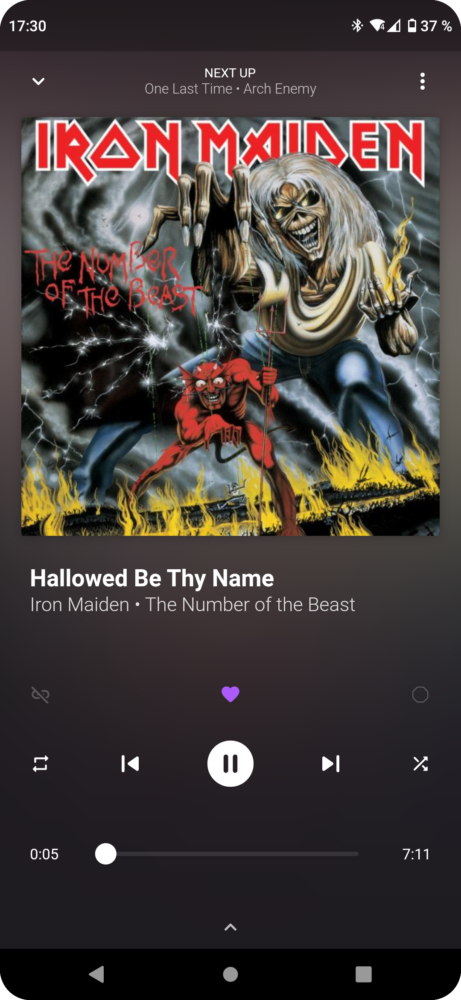
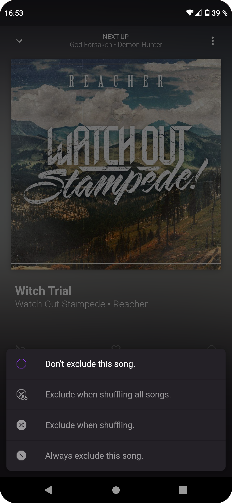

# mucke

 
A music player that gets the best out of your local collection.

<!-- A music player that treats your precious files like no one else. -->

## Features

- Like songs to hear them more often in shuffle mode.
- Exclude songs from playing in shuffle mode.
- Link songs together to play them back-to-back in shuffle mode.
- Create smart playlists by filtering and sorting your library.
- Customize your landing page for a quick start.

## Previews

&nbsp;&nbsp;&nbsp;&nbsp;
