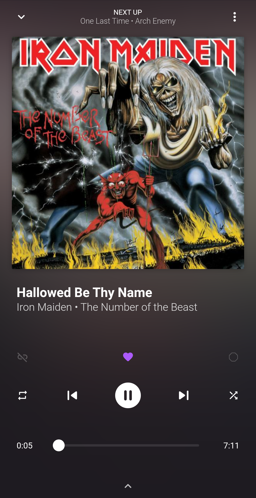
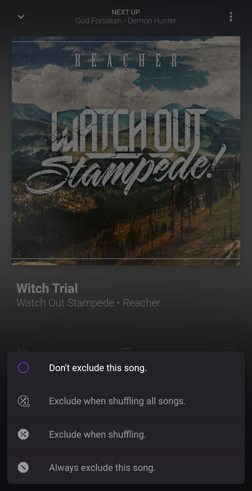
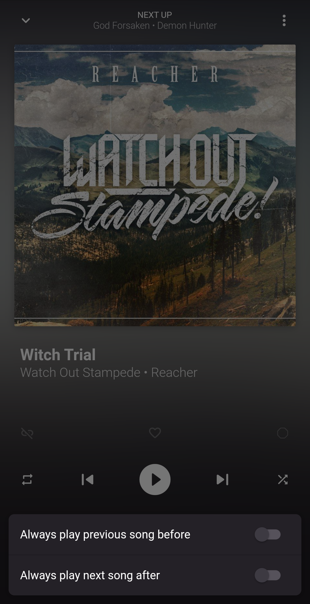
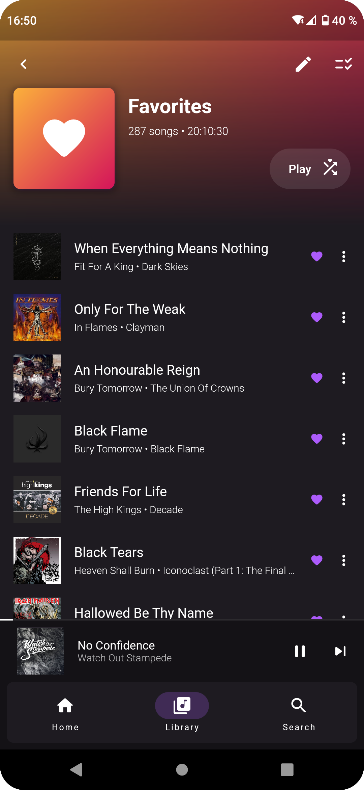
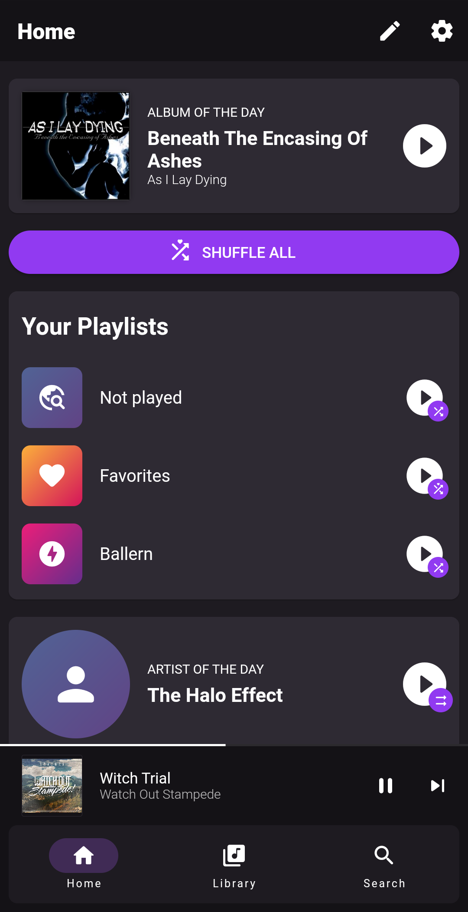

# mucke

 
A music player that gets the best out of your local collection.

<!-- A music player that treats your precious files like no one else. -->

## Features

- Like songs to hear them more often in shuffle mode.
- Exclude songs from playing in shuffle mode.
- Link songs together to play them back-to-back in shuffle mode.
- Create smart playlists by filtering and sorting your library.
- Customize your landing page for a quick start.

## Previews

&nbsp;&nbsp;&nbsp;&nbsp;

## Download

Or get the latest APK from the [Releases section](https://github.com/moritz-weber/mucke/releases/latest).

## Translations

mucke uses [Weblate](https://hosted.weblate.org/engage/mucke/) for community translations of the app. Feel free to contribute to any language you know:

## Donating

mucke is a hobby project. Its development progress is largely limited by time and mood 😉
Money won't change that, so there is no option to donate to mucke.

However, if you enjoy mucke and want to support the project monetarily, you could donate to the projects that mucke depends on.
This is a short list of developers, you could support instead:

- [ryanheise](https://github.com/sponsors/ryanheise)
- [simolus3](https://github.com/sponsors/simolus3)
- [Baseflow](https://github.com/sponsors/Baseflow)

## Thanks

Thanks to [@maxxs.arts](https://www.instagram.com/maxxs.arts/) for designing the logo 🤘
